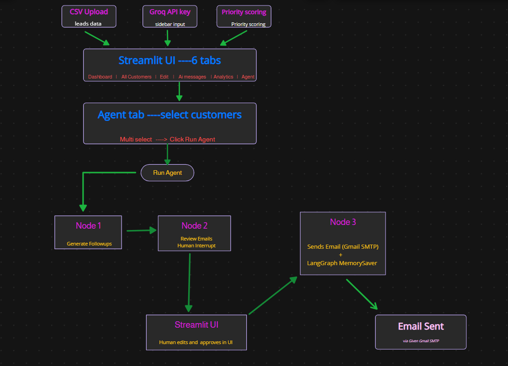

# 🤖 CRM Outreach Assistant


A simple AI assistant that helps small sales teams stay on top of their follow-ups. You upload a CSV of your leads, it automatically figures out who needs attention first, and it can even write and send personalized follow-up emails for you — with you approving every single email before it goes out.
---
## 📑 Table of Contents

- [📖 What this project does](#-what-this-project-does)
- [🎥 Demo & Links](#-demo--links)
- [✨ Features](#-features)
- [📋 CSV Format](#-csv-format)
- [🧠 How the Priority Score Works](#-how-the-priority-score-works)
- [🛠️ Tech Stack](#️-tech-stack)
- [🚀 Getting Started](#-getting-started)
- [🗂️ Project Structure](#️-project-structure)
- [🔒 Privacy](#-privacy)
- [📄 License](#-license)
---

## 🎥 Demo & Links
### 🌐 Live Demo

👉 **[Try CRM Outreach Assistant](https://crm-management-assistant.streamlit.app)**

## 🏗️ Architecture


---
## 📖 What this project does

I built this because manually tracking "who did I follow up with, and when" gets messy fast once you have more than a handful of leads. So the app does three things:

1. **Organizes your leads** — upload a CSV, and it scores and sorts everyone by how urgently they need a follow-up.
2. **Writes follow-up messages for you** — using Groq's LLaMA 3.3 model, personalized to each lead's notes and status.
3. **Runs an actual email-sending agent** — for your overdue leads, it can draft, let you review, and then send real emails through Gmail, with a human (you) always checking the emails before they go out.

Everything happens inside your own browser session. No login, no shared database — your data disappears the moment you close the tab (unless you download it).

---

## ✨ Features

### 📥 Bring your own data
Upload a leads CSV with just a `name` and `contact` column — everything else (status, interest level, dates, notes) is optional and gets auto-filled if missing. A downloadable template is available right on the upload screen if you're not sure what format to use.

### 🔑 Bring your own keys — right in the browser
No `.env` file needed to actually use the app. You paste your **Groq API key** and your **Gmail address + app password** directly into the sidebar while using the app. Nothing is stored on a server — it only lives in your session, and it's gone once you close or reset.

### 🗂️ Full CRUD on your leads
This isn't just a viewer — you can fully manage your leads from the UI:
- **Create** — add a new customer through a form in the sidebar
- **Read** — browse everyone in a searchable, filterable table (filter by status, interest level, or urgency bucket)
- **Update** — edit any lead's details inline and save changes instantly
- **Delete** — remove a lead, and the app cleanly cleans up its message history too so nothing gets orphaned

### 🎯 Priority scoring, so you know who to call first
Every lead gets a score from 0–10, based on:
- How urgent their follow-up date is (overdue, due today, or coming up soon)
- Their current status (Follow-up Needed, Interested, New, Closed)
- Their interest level (High, Medium, Low)

That score turns into an easy label — 🔴 Hot, 🟡 Warm, or 🟢 Cool — so you can scan your list and instantly know who matters most today.

### 📅 Overdue / Due Today / Upcoming, sorted automatically
The dashboard buckets every lead into one of these three groups based on their next follow-up date, so you never have to manually check dates against today's calendar.

### ✍️ AI-generated follow-up messages
Pick any lead, pick a tone (Professional, Friendly, Polite, or Persuasive), and the app writes a short, personalized message grounded in that lead's actual notes 

### 🤖 The real agent workflow — with a human in the loop
This is the part I'm most excited about. For your overdue leads, there's a proper agent (built with LangGraph) that runs a multi-step workflow:

1. **Generate step** — the agent writes a draft follow-up email for every selected customer.
2. **Human review step** — the agent *pauses itself* here. It doesn't send anything yet. Instead, it hands every draft back to you in the UI, where you can:
   - ✅ **Approve** it as-is
   - ✏️ **Edit** the subject or body before sending
   - ❌ **Uncheck it to skip** that customer entirely
3. **Send step** — once you hit "Approve & Send," the agent resumes from exactly where it paused and sends only the emails you approved, using your Gmail credentials.

This pause-and-resume behavior is what's called a "human-in-the-loop" agent — the AI never sends anything without you explicitly signing off first.

### 📊 Agent results — success, skipped, and failed
After the agent sends emails, it doesn't just say "done." It reports back exactly what happened for every single customer:
- ✅ **Sent** — delivered successfully
- ⏭️ **Skipped** — you unchecked it, so it was intentionally not sent
- ❌ **Failed** — with the actual error shown, so you know why (wrong password, invalid address, etc.)

### 📈 Analytics dashboard
A dedicated analytics tab gives you a visual read on your whole pipeline — leads broken down by status, by interest level, and by follow-up urgency — so you can spot patterns without digging through the raw table.

### 📤 Export anytime
Download your full list, or just a filtered view, as a CSV at any point — with all your edits and computed priority scores included.

---


## 📋 CSV Format

Your leads CSV needs at least these two columns — everything else is optional and gets auto-filled:

| Column | Required | Description |
|---|---|---|
| `name` | ✅ | Contact's full name |
| `contact` | ✅ | Email or phone number |
| `company` | ❌ | Company name |
| `status` | ❌ | `New`, `Interested`, `Follow-up Needed`, or `Closed` |
| `interest_level` | ❌ | `Low`, `Medium`, or `High` |
| `notes` | ❌ | Free-text notes about the lead |
| `last_interaction` | ❌ | Date of last contact (YYYY-MM-DD) |
| `next_followup` | ❌ | Scheduled follow-up date (YYYY-MM-DD) |

Don't have a CSV handy? There's a one-click template download right on the upload screen.

---

## 🧠 How the priority score works

Each lead gets a score from **0 to 10**, made up of three parts:

| Component | How it's scored |
|---|---|
| **Urgency** (next follow-up date) | Overdue → +4, Due Today → +2, Within 3 days → +1 |
| **Status** | Follow-up Needed → 4, Interested → 3, New → 2, Closed → 0 |
| **Interest level** | High → 3, Medium → 2, Low → 1 |

And the final label:
- 🔴 **Hot** — score ≥ 8
- 🟡 **Warm** — score ≥ 5
- 🟢 **Cool** — below 5

---

## 🛠️ Tech Stack

| Layer | Technology |
|---|---|
| Frontend / UI | [Streamlit](https://streamlit.io/) |
| Agent orchestration | [LangGraph](https://github.com/langchain-ai/langgraph) — handles the pause-and-resume, human-in-the-loop flow |
| Data processing | [Pandas](https://pandas.pydata.org/) |
| Charts | [Plotly](https://plotly.com/) |
| AI / LLM | [Groq Python SDK](https://github.com/groq/groq-python) — LLaMA 3.3 70B |
| Email sending | Gmail SMTP |
| Database | [SQLAlchemy](https://www.sqlalchemy.org/) + SQLite |
| Env management | [python-dotenv](https://github.com/theskumar/python-dotenv) |
| Version control | Git |
---

## 🚀 Getting Started

### 1. Clone the repo

```bash
git clone https://github.com/MLbyTharun/crm-outreach-assistant.git
cd crm-outreach-assistant
```

### 2. Set up a virtual environment

```bash
python -m venv venv
source venv/bin/activate        # On Windows: venv\Scripts\activate
```

### 3. Install the dependencies

```bash
pip install -r requirements.txt
```

### 4. Run it

```bash
streamlit run Main_app/app.py
```

That's it — no `.env` file is required to get started. Once the app opens in your browser, you'll enter your Groq API key and Gmail credentials directly in the sidebar whenever you want to use the AI or email features.

> Get a free Groq API key at [console.groq.com](https://console.groq.com). For Gmail, you'll need an **App Password** (Google Account → Security → 2-Step Verification → App Passwords) — your regular Gmail password won't work for SMTP.

---
## 🗂️ Project Structure

```
crm-outreach-assistant/
│
├── Main_app/
│   └── app.py                  # Streamlit app — all the UI lives here
│
├── model/
│   └── llm.py                  # Talks to Groq's LLaMA 3.3 model to write messages
│
├── important_functions/
│   ├── scoring.py               # Works out the priority score and label for each lead
│   └── tools.py                 # Session setup, data cleanup, follow-up bucketing
│
├── agent/
│   ├── state.py                 # Defines what data the agent passes around
│   ├── nodes.py                 # The actual steps: generate → review → send
│   ├── graph.py                 # Wires those steps together into a LangGraph agent
│   └── email_sender.py          # Sends the email over Gmail's SMTP
│
├── Database/
│   ├── database.py              # SQLAlchemy + SQLite setup
│   └── models.py                # Table definitions (for future persistent storage)
│
├── .gitignore
└── README.md
```

## 🔒 Privacy

Everything you upload — leads, generated messages, edits — stays only in your own browser session. Nothing is persisted to a shared server or visible to other users. API keys and Gmail credentials are typed in live and used only for that session; they're never saved anywhere. Closing the tab or hitting "New file" wipes it all.

---

## 📄 License

Open source under the Apache 2.0 License. — fork it, modify it, build on it.